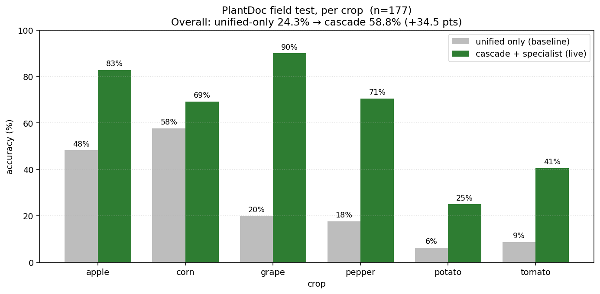
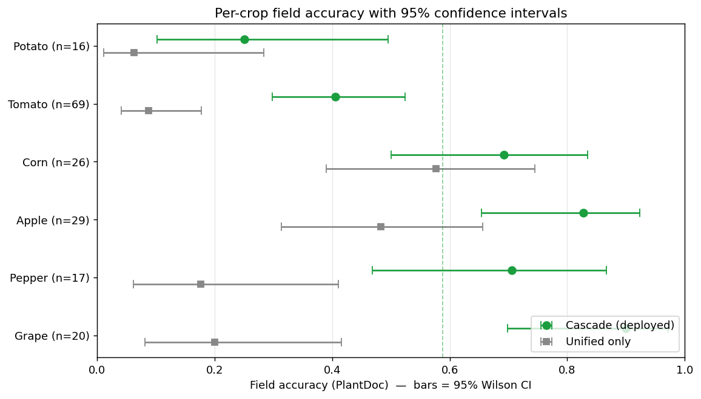
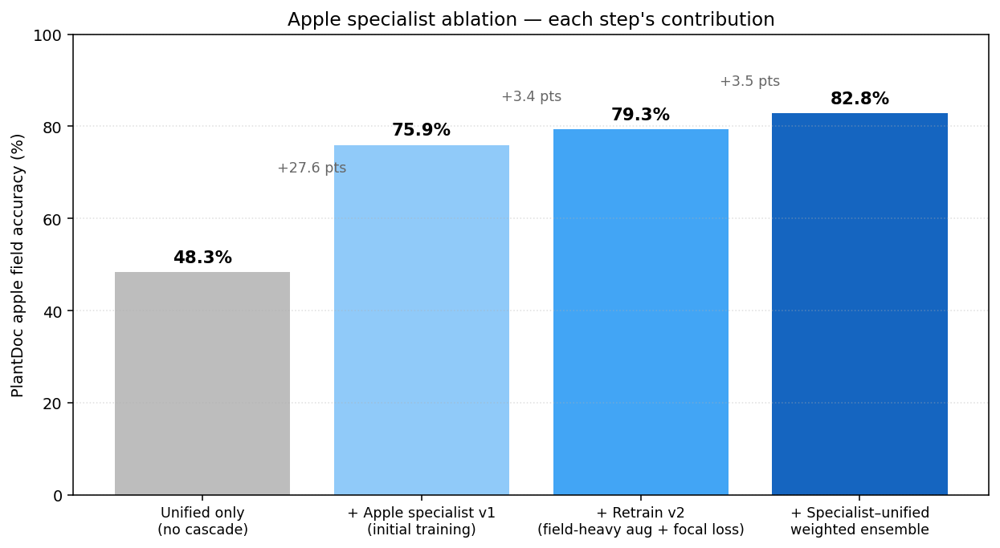
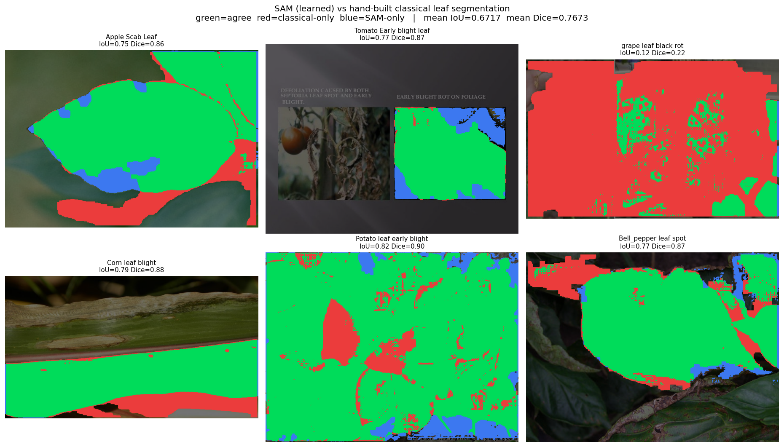

# CropCare AI

**Plant Disease Detection & Treatment Advisor** -> a full-stack computer-vision system that takes one leaf photo and returns the **crop**, the **disease**, the **severity**, and **how to treat it**. It pairs a hand-built classical CV pipeline that *measures* the disease with a deep-learning cascade that *names* it and a local LLM that *explains* it.

> **The AI names the disease · the CV pipeline measures the severity · the LLM writes the advice.**

## Highlights

- **Doubles real-world accuracy.** A crop-routed cascade of 6 per-crop specialists lifts field accuracy from **24.3% → 58.8%** on real PlantDoc photos (**+34.5 points**, statistically significant), and reaches **82.8% on apple** — competitive with far larger transformer models, trained end-to-end on a single **4 GB laptop GPU**.
- **99.4%** on controlled PlantVillage (27 classes across 6 crops).
- **Classical CV, from scratch.** Six segmentation methods (including graph cut and SLIC superpixels), a 2-of-3 consensus, SAM-assisted leaf isolation, plus FFT and wavelet analysis — all hand-implemented, not library one-liners.
- **Research-grade evaluation.** Separate lab/field test sets, a naive-transfer baseline, 95% confidence intervals, a calibration measurement, and a foundation-model (SAM) segmentation benchmark.
- **Deployed end-to-end.** React frontend · FastAPI backend · MariaDB · local Ollama LLM advisory.

## Start here

Open **[demo.ipynb](demo.ipynb)** — a single notebook that runs the entire pipeline (DIP → segmentation → DL cascade → LLM advice) on a diseased leaf with inline visualizations. All numbers below are measured and saved as JSON under [ml/plant/artifacts/reports/](ml/plant/artifacts/reports/).

## Results

### Field accuracy — the cascade more than doubles it



| Crop | Unified only | Cascade (live) | 95% CI (cascade) |
|---|---|---|---|
| Grape | 20.0% | **90.0%** | [69.9–97.2%] |
| Apple | 48.3% | **82.8%** | [65.5–92.4%] |
| Pepper | 17.6% | **70.6%** | [46.9–86.7%] |
| Corn | 57.7% | **69.2%** | [50.0–83.5%] |
| Tomato | 8.7% | **40.6%** | [29.8–52.4%] |
| Potato | 6.2% | **25.0%** | [10.2–49.5%] |
| **Overall** | **24.3%** | **58.8%** | **[51.4–65.7%]** |

The cascade's confidence interval lies **entirely above** the unified model's, so the improvement is statistically significant (Wilson + 20k-bootstrap, reproducible via [scripts/compute_statistical_rigor.py](scripts/compute_statistical_rigor.py)).



### Where the accuracy comes from (apple ablation, n=29)



| Stage | Apple field accuracy |
|---|---|
| Unified model alone | 48.3% |
| + route to apple specialist | 75.9% (+27.6) |
| + retrain (field-heavy aug + focal loss) | 79.3% (+3.4) |
| + specialist↔unified ensemble | **82.8%** (+3.5) |

### Controlled set (PlantVillage, clean lab photos)

Unified model: **99.44%** accuracy / 99.36% macro-F1 over 27 classes — on par with the published state of the art, which is saturated at ≥99% on this split.

### Classical vs. a foundation model (SAM)



The hand-built leaf segmentation agrees with **Segment Anything (SAM)** at **mean IoU 0.67 / Dice 0.77**. SAM is also deployed in the live pipeline to isolate the leaf on cluttered green-on-green field scenes; all lesion segmentation, consensus, and severity stay classical and from scratch. Reproducible via [scripts/compare_sam_vs_classical.py](scripts/compare_sam_vs_classical.py).

## What's inside (engineered inference stack)

1. **Crop-routed cascade of specialists** — the unified model identifies the crop; a per-crop CNN (trained on that crop only) refines the disease label.
2. **Weighted geometric-mean ensemble** — specialist (0.7) blended with the unified model restricted to the crop's labels (0.3). See [ml/plant/dl/cascade.py](ml/plant/dl/cascade.py).
3. **Open-set crop gate** — rejects unsupported crops instead of forcing a wrong label.
4. **SAM-assisted leaf isolation + 2-of-3 consensus segmentation** — object-shape leaf isolation (classical fallback), then a spatial-tolerance vote across thresholding/clustering/graph-cut with a healthy-tissue colour gate. See [ml/plant/cv/analysis_pipeline.py](ml/plant/cv/analysis_pipeline.py).
5. **Field-validation checkpoint selection** — specialists selected on a held-out *field* split, fixing lab→field collapse (recovered a dead potato class 0/8 → 2/8 recall).

## Architecture

```
Leaf photo
  → Frontend (React)  →  Backend (FastAPI) coordinator
        ├── Engine 1 — Classical CV:  leaf isolation → 6 segmenters → consensus → severity %
        └── Engine 2 — DL cascade:    unified crop → specialist → ensemble → open-set gate
  → Merge (disease name from DL, severity from CV)  →  LLM advisory (Ollama)  →  DB → UI
```

## Quick start

```powershell
# backend + ML environment
python -m venv .venv ; .venv\Scripts\activate ; pip install -r requirements.txt
# run the full pipeline on one image
python ml/plant/cv/analyze.py "path\to\leaf.jpg" --output-dir out --output-json out/analysis.json
# disease prediction (cascade)
python ml/plant/dl/cascade.py "path\to\leaf.jpg"
```

Helper scripts to launch the stack: [scripts/run-backend.ps1](scripts/run-backend.ps1), [scripts/run-frontend.ps1](scripts/run-frontend.ps1), [scripts/start-cropcare-db.ps1](scripts/start-cropcare-db.ps1).

## Tech stack

Python · PyTorch + timm (EfficientNetV2-S) · scikit-learn · SciPy/NumPy/Pillow · Segment Anything · FastAPI · React/Vite/TypeScript · MariaDB · Ollama (llama3.2:3b).

## Future work

- Learned severity head (regression on infected-area %) to replace the CV heuristic.
- Temperature scaling so the displayed confidence is calibrated.
- Larger backbone / cloud GPU run (scoped ConvNeXt-Base, expected apple → ~87–90%) to push tomato and the overall ceiling.

## Folder guide

- `frontend/` — React UI · `backend/` — FastAPI API + orchestration
- `ml/common/` — shared image-processing helpers
- `ml/plant/cv/` — classical computer vision / DIP · `ml/plant/dl/` — training + inference · `ml/plant/llm/` — advisory helpers
- `ml/plant/artifacts/` — checkpoints, reports, figures (all measured numbers)
- `datasets/plant/` — PlantVillage + PlantDoc · `database/` — SQL schema · `docs/` — design notes and full work history · `scripts/` — pipeline + launch helpers

> `.venv` folders and large model binaries are gitignored — recreate with `python -m venv .venv` and `pip install -r requirements.txt`.
